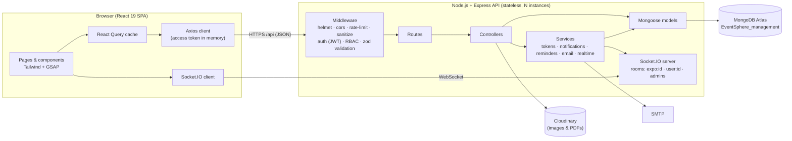
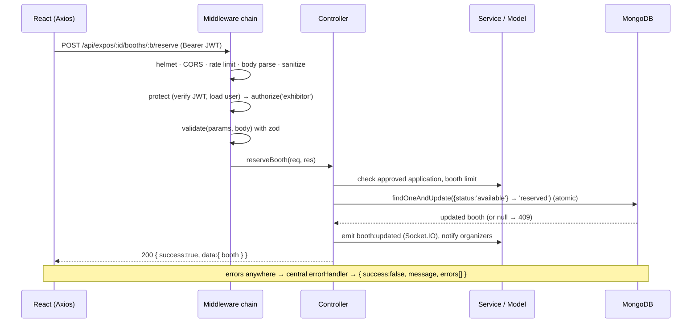
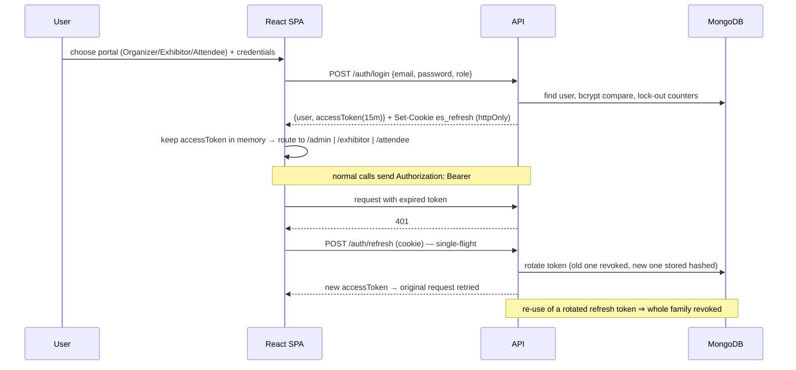
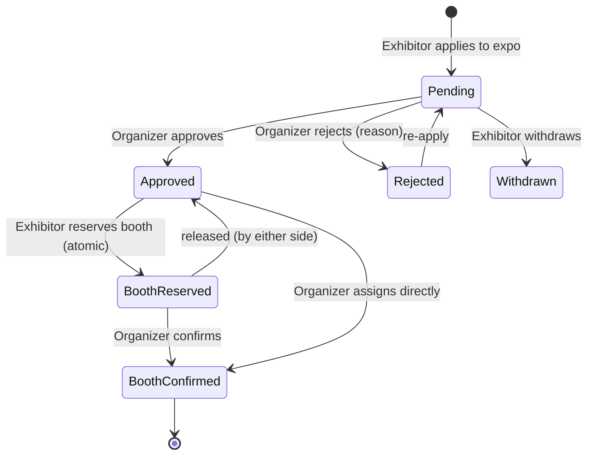
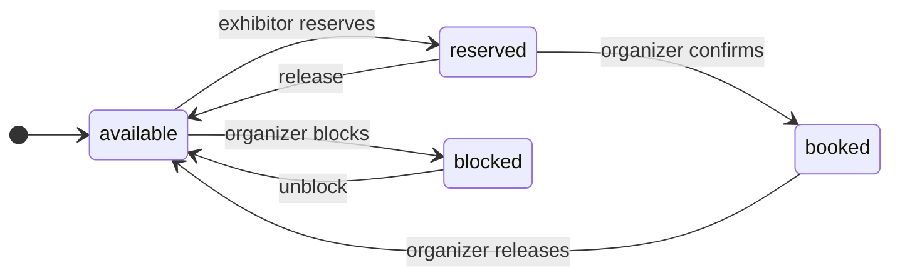
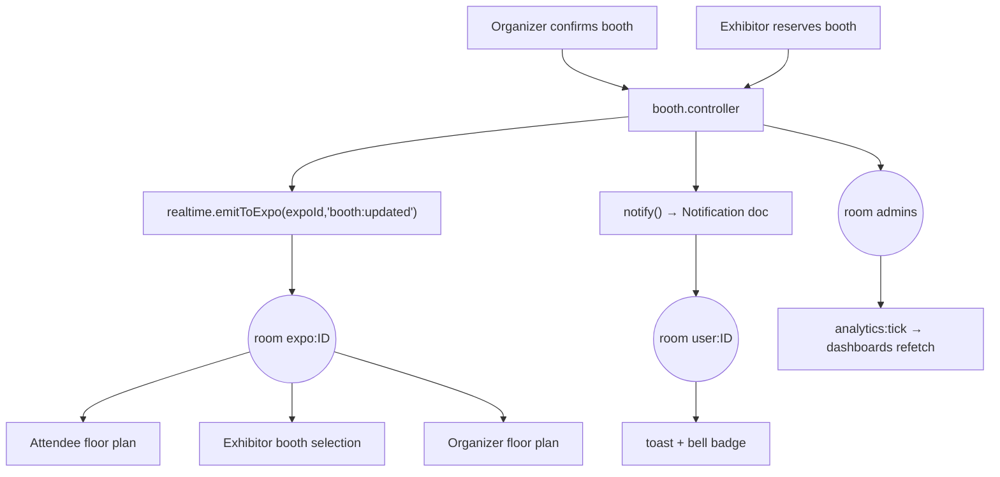

# Architecture

## 1. Overview

EventSphere is a classic **MERN** application organised with an **MVC** structure:

| MVC | In this project |
|---|---|
| **Model** | Mongoose schemas in `backend/src/models/` (data + invariants + indexes) |
| **View** | The React single-page app in `frontend/` (three role portals) |
| **Controller** | Express controllers in `backend/src/controllers/`, wired by `routes/`, protected by `middleware/`, with reusable business logic in `services/` |



## 2. Request lifecycle



## 3. Authentication & session flow



## 4. Domain workflow — from application to booth





## 5. Real-time design



* Public rooms (`expo:<id>`) can be joined anonymously; private rooms need a valid token at connect time.
* The React hook `useLiveBooths` loads the plan over REST and then patches the React-Query cache from socket events — no polling.
* Reminders: a scheduler ticks every 30 s and atomically claims due reminders (`reminderSent:false → true`) before notifying, so multiple instances never double-send.

## 6. Key design decisions

| Decision | Reason |
|---|---|
| Access token in memory + httpOnly refresh cookie | XSS cannot steal long-lived credentials; CSRF is mitigated by `SameSite` + CORS allow-list |
| zod validation on every endpoint | One declarative whitelist: type safety, mass-assignment protection, consistent field errors the UI shows inline |
| Atomic conditional updates instead of read-then-write | Correctness under concurrency (booths, session seats, reminders) without distributed locks |
| React Query + socket cache patches | Fewer requests, instant UI, simple invalidation |
| Tailwind v4 semantic tokens | Light/dark theming and WCAG contrast managed in one file |
| SVG floor plan (no canvas / heavy lib) | Native accessibility (focusable, labelled elements), crisp zoom, tiny bundle |
| Custom lightweight charts | No chart-library weight; accessible HTML/SVG; GSAP-animated |
| Route-level code splitting + manual vendor chunks | Fast first paint; each portal loads only what it uses |
| Env validation at boot | Misconfiguration fails fast, never silently insecure |

## 7. Folder structure

```
EventSphere_management/
├── README.md                       ← start here
├── docs/                           ← documentation set (this folder)
│   ├── USER_GUIDE.md              ← step-by-step guide for every role
│   ├── ARCHITECTURE.md · API.md · DATABASE.md · SECURITY.md
│   ├── DEPLOYMENT.md · TESTING.md · UI_DESIGN_SYSTEM.md
│   └── REQUIREMENTS_TRACEABILITY.md
├── backend/                        ← Node.js + Express + Mongoose  (Model / Controller layers)
│   ├── .env  .env.example          ← configuration (mongo_uri, secrets…)
│   ├── package.json
│   ├── uploads/                    ← local-disk fallback when Cloudinary is not configured
│   ├── backups/                    ← JSON database backups
│   ├── tests/                      ← integration tests (auth, workflow)
│   └── src/
│       ├── server.js               ← bootstrap: DB, HTTP, sockets, scheduler, graceful shutdown
│       ├── app.js                  ← Express app: security middleware, routes, error handling
│       ├── config/                 ← env.js (validated), db.js, constants.js
│       ├── models/                 ← User, RefreshToken, Expo, Booth, ExhibitorProfile, Application,
│       │                             Session, SessionRegistration, ExpoRegistration, Visit, Notification,
│       │                             Inquiry, Ticket, Conversation, Message, Feedback
│       ├── controllers/            ← auth, expo, booth, application, exhibitor, session,
│       │                             inquiry, ticket, message, analytics, misc, upload
│       ├── routes/index.js         ← every endpoint + its middleware chain
│       ├── middleware/             ← auth (protect/authorize), validate, sanitize, rateLimiters,
│       │                             errorHandler, upload
│       ├── validators/             ← zod schemas (auth, expo/booth/session, exhibitor/…)
│       ├── services/               ← token, email, storage (Cloudinary), notification, reminder, realtime, access
│       ├── sockets/index.js        ← Socket.IO server (rooms, auth)
│       ├── utils/                  ← ApiError, asyncHandler, logger, helpers
│       ├── seed/seed.js            ← demo data
│       └── scripts/                ← backup.js, restore.js
└── frontend/                       ← React 19 + Vite + Tailwind v4 + GSAP  (View layer)
    ├── index.html  vite.config.js
    └── src/
        ├── main.jsx  App.jsx       ← providers + route table (role-guarded, lazy-loaded)
        ├── index.css               ← design tokens (light/dark), base styles
        ├── lib/                    ← api (axios + refresh), socket, motion (GSAP), utils
        ├── context/                ← AuthContext, ThemeContext
        ├── hooks/                  ← useReveal, useCountUp, useLiveBooths, useSocketEvent, useForm…
        ├── components/
        │   ├── ui/                 ← design-system primitives (+ Modal)
        │   ├── layout/             ← DashboardLayout, AttendeeLayout, Guards, header parts
        │   ├── charts/             ← LineChart, BarList, Donut
        │   └── FloorPlan.jsx       ← interactive SVG floor plan (admin/select/view/heatmap)
        └── pages/
            ├── Landing.jsx
            ├── auth/               ← Login, Register, Forgot/Reset password, role selector
            ├── admin/              ← Organizer portal: Dashboard, Expos, ExpoForm, FloorPlanManager,
            │                         Applications, Schedule, Analytics, Support, FeedbackAdmin, Users, shared.jsx
            ├── exhibitor/          ← Exhibitor portal: Dashboard, Profile, Staff, Expos, Applications, Booths,
            │                         Inquiries, Messages, Support + Thread, BoothParts, shared.js
            ├── attendee/           ← Attendee interface: Home, Expos, ExpoDetail, Exhibitors, ExhibitorDetail,
            │                         Schedule, FloorPlanViewer, Agenda, Inquiries + SessionCard, ExpoCard,
            │                         ExhibitorCard, BoothDetails, Countdown, RegisterButton, calendar.js
            └── shared/             ← Notifications, Account & privacy, Feedback, NotFound
```

## 8. Mapping to the eProject specification

| Spec area | Location |
|---|---|
| User Authentication | `auth.controller.js`, `token.service.js`, `pages/auth/*` |
| Admin/Organizer Dashboard | `expo`, `booth`, `application`, `session`, `analytics` controllers · `pages/admin/*` |
| Exhibitor Portal | `exhibitor`, `application`, `booth`, `message`, `ticket` controllers · `pages/exhibitor/*` |
| Attendee Interface | `expo`, `session`, `exhibitor`, `inquiry` controllers · `pages/attendee/*` |
| Real-time updates | `sockets/`, `services/realtime.js`, `hooks/useLiveBooths` |
| Feedback & support | `ticket`, `misc` (feedback) controllers · support & feedback pages |
| Non-functional | see `SECURITY.md`, `DEPLOYMENT.md`, `TESTING.md`, `REQUIREMENTS_TRACEABILITY.md` |
