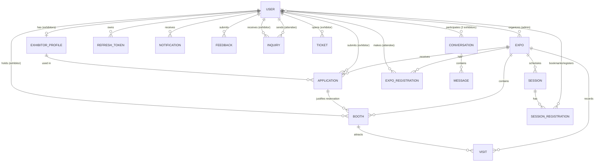

# Database Design

EventSphere uses **MongoDB** (Atlas) through **Mongoose**. Database name: `EventSphere_management`.

## Entity-relationship diagram



## Collections

| Collection | Purpose | Key fields | Indexes |
|---|---|---|---|
| `users` | All accounts | `name, email, password(bcrypt, select:false), role, isActive, failedLoginAttempts, lockUntil, consentAt, passwordReset*` | `email` unique, `role`, text(name,email,company) |
| `refreshtokens` | Rotating refresh sessions | `user, tokenHash, family, revokedAt, expiresAt` | `tokenHash` unique, `family`, **TTL** on `expiresAt` |
| `expos` | Expo events | `title, theme, startDate, endDate, location{}, status, featured, capacity, floorPlan{cols,rows}, organizer` | `status+startDate`, `organizer`, text(title,description,theme) |
| `booths` | Booth slots on the floor plan | `expo, code, zone, x, y, w, h, size, price, status, exhibitor, application, showcase{}` | `expo+code` **unique**, `expo+status`, `exhibitor` |
| `exhibitorprofiles` | Company profile (1 per exhibitor) | `user, companyName, logo, categories[], contact{}, products[], documents[], staff[]` | `user` unique, `categories`, text(company, products…) |
| `applications` | Exhibitor application per expo | `expo, exhibitor, profile, status, reviewedBy, rejectionReason` | `expo+exhibitor` **unique**, `expo+status+createdAt` |
| `sessions` | Schedule items | `expo, title, type, location(room), startTime, endTime, speakers[], capacity, registeredCount, bookmarkCount` | `expo+startTime`, `expo+location+startTime` |
| `sessionregistrations` | Bookmark / registration + reminder | `user, session, expo, kind, reminderMinutes, remindAt, reminderSent` | `user+session` **unique**, `remindAt+reminderSent` |
| `exporegistrations` | Attendee ↔ expo | `user, expo` | `user+expo` unique |
| `visits` | Engagement events for analytics | `expo, type(booth/expo/exhibitor), booth, user, at` | `expo+type+at`, `booth`, **TTL** 1 year |
| `notifications` | In-app notifications | `user, type, title, body, link, read` | `user+read+createdAt`, **TTL** 90 days |
| `inquiries` | Attendee → exhibitor inquiry / appointment | `expo, attendee, exhibitor, type, subject, appointmentAt, status, messages[]` | `attendee+updatedAt`, `exhibitor+updatedAt` |
| `tickets` | Exhibitor ↔ organizer support | `exhibitor, subject, category, priority, status, assignedTo, messages[]` | `exhibitor+updatedAt`, `status+updatedAt` |
| `conversations` / `messages` | B2B chat | `participants[2], pairKey(unique), lastMessage, unread{}` / `conversation, sender, body` | `pairKey` unique; `conversation+createdAt` |
| `feedbacks` | Suggestions / issue reports | `user, type, message, rating, status` | `status+createdAt` |

## Integrity rules enforced in the data layer

| Rule | Mechanism |
|---|---|
| One application per exhibitor per expo | unique `(expo, exhibitor)` |
| Booth codes unique inside an expo | unique `(expo, code)` |
| A booth can only be taken once, even under concurrent clicks | conditional `findOneAndUpdate({status:'available'})` (atomic) |
| Sessions never oversell | `findOneAndUpdate` with `$expr: registeredCount < capacity` |
| One bookmark/registration per user per session | unique `(user, session)` |
| Exactly one B2B thread per exhibitor pair | `pairKey = sorted(idA:idB)` unique |
| Booths never overlap / stay inside the floor plan | validated in the booth controller before every write |
| Reminders are delivered once, even with several server instances | atomic claim: `findOneAndUpdate({reminderSent:false} → true)` |
| Old data cleans itself | TTL indexes on refresh tokens, notifications, visits |

## Seed data

`npm run seed` (inside `backend/`) creates: 1 organizer, 11 exhibitor companies in different application states, 29 attendees, 4 expos, 44 booths (32 for the main expo with confirmed/pending/blocked states), 13 sessions, registrations, 700+ visit events, inquiries, tickets, a B2B conversation, feedback and notifications. Use `npm run seed -- --force` to wipe and reseed.

## Backup & restore

```bash
cd backend
npm run backup                 # → backups/<timestamp>/<collection>.json (EJSON, type-safe)
npm run backup -- --keep=14    # keep only the 14 newest backups
npm run restore -- <folder> [--drop]
```

A first backup of the seeded database is stored in `backend/backups/`. In production also enable **Atlas Cloud Backup** (continuous snapshots + point-in-time restore) and schedule `npm run backup` with cron / Task Scheduler.
