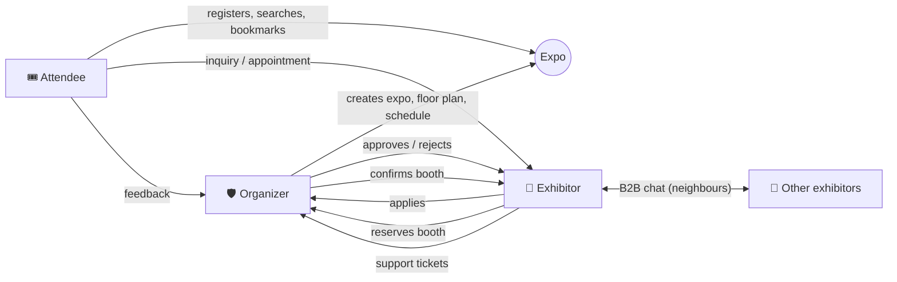
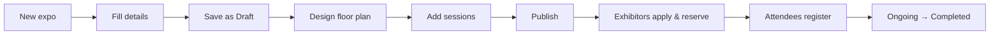
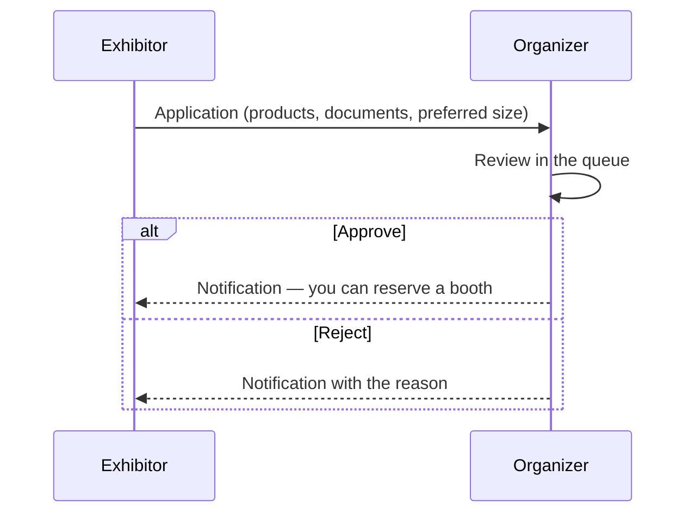
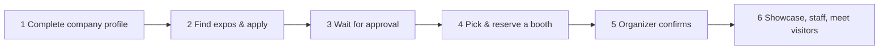
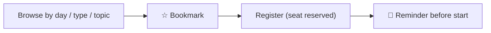

# EventSphere User Guide

Welcome! This guide walks every kind of user through EventSphere, step by step. Jump to your role:

* [1. Getting started (everyone)](#1-getting-started-everyone)
* [2. Organizer guide](#2-organizer-guide)
* [3. Exhibitor guide](#3-exhibitor-guide)
* [4. Attendee guide](#4-attendee-guide)
* [5. Account, privacy & accessibility](#5-account-privacy--accessibility)
* [6. Troubleshooting & FAQ](#6-troubleshooting--faq)
* [7. Glossary & status reference](#7-glossary--status-reference)

---

## How the three roles work together

---

## 1. Getting started (everyone)

### 1.1 Open the app
Go to the address your organizer gave you (locally: `http://localhost:5173`). The landing page presents the platform and upcoming expos. Use the **sun/moon** button at any time to switch between light and dark mode — your choice is remembered.

### 1.2 Create an account
1. Click **Get started** (or **Create an account** on the login page).
2. Choose **how you will use EventSphere** with the three-way selector:

| Choose | If you are… | Extra fields |
|---|---|---|
| **Organizer** | running the event | *Organizer access code* (given to you by EventSphere) |
| **Exhibitor** | a company showing products | *Company name* |
| **Attendee** | visiting the expo | – |

3. Enter your name, email and a password. A checklist shows the rules (8+ characters, upper-case, lower-case and a number).
4. Tick the **Terms & Privacy** consent (required). The marketing-updates box is optional.
5. Click **Create account** — you are taken straight to your own portal.

### 1.3 Sign in
1. Open **Sign in**, select your portal (**Organizer / Exhibitor / Attendee**) — arrow keys work too.
2. Enter email + password → **Sign in as …**.
3. If you pick the wrong portal you will be told which one your account belongs to.
4. After 5 wrong passwords the account is locked for 15 minutes for your protection.

### 1.4 Forgot your password?
**Sign in → Forgot password?** → enter your email → open the link in the email (valid 30 minutes, single use) → choose a new password. All devices are signed out afterwards. *(In a development install without an email server the link is shown on screen.)*

### 1.5 Finding your way around
| Area | What it does |
|---|---|
| **Sidebar** (organizer/exhibitor) or **top menu / bottom tab bar** (attendee, on phones) | Main navigation |
| **🔔 Bell** | Live notifications: approvals, reminders, messages, schedule changes. Click one to jump to the relevant page. A toast pops up when something new arrives. |
| **Avatar menu** | Account & privacy, sign out |
| **Skip to content** | Press **Tab** on any page to reveal it (keyboard users) |

---

## 2. Organizer guide

Sign in as **Organizer** → you land on the **Dashboard**.

### 2.1 Dashboard
KPI cards (expos, attendees, pending applications, open tickets, revenue, booth occupancy), live charts for the selected expo (registrations over time, booth status, session popularity) and a short list of applications waiting for review. It updates **automatically** when something happens (new application, new ticket, booth change).

### 2.2 Create and manage expos — *Expo events*

1. **Expo events → New expo**.
2. Fill in **title, theme, description, dates, venue/address/city/country, capacity, categories**, optional banner image and the **floor-plan size** (columns × rows). The end date must not be before the start.
3. **Status**: *Draft* (only you can see it) → *Published* (visible to everyone) → *Ongoing* → *Completed*, or *Cancelled* (registered attendees are notified).
4. Use the buttons on each expo card to **edit**, open its **floor plan / schedule / analytics**, quickly **publish/unpublish**, or **delete** (this also deletes its booths, sessions, applications and registrations — you are asked to confirm).

### 2.3 Floor plan & booth allocation — *Floor plan & booths*

Select the expo at the top. The plan shows every booth; the colours are:

| Colour | Meaning |
|---|---|
| 🟩 Green | Available |
| 🟨 Amber stripes | Reserved by an exhibitor — **Pending approval** |
| 🟥 Red | Occupied / confirmed (company name shown) |
| 🟦 Blue | The booth you selected |
| ▒ Grey | Blocked (not for sale) |

**Build the plan**
* **Generate grid** — enter rows, columns, size, spacing, code prefix and price to create many booths at once.
* **Add booth** — create a single booth with exact position (x, y), size, price and zone.
* **Move a booth** — drag it (it snaps to the grid; overlaps are refused). Keyboard: focus the booth and press **Shift + arrow keys**.

**Handle reservations** — click a booth to open its panel:
* **Confirm reservation** → turns red and the exhibitor is notified.
* **Release** → makes it available again.
* **Assign to exhibitor** → pick an exhibitor with an approved application to book it directly.
* **Block / Unblock**, edit price/size/zone, or **Delete** (only when no exhibitor holds it).
* The *Pending reservations* list gives one-click Confirm / Release.

Changes appear instantly on everyone's screen (exhibitors choosing booths, attendees viewing the map).

### 2.4 Exhibitor applications — *Exhibitor applications*

1. Filter the queue by **status**, **expo** or **company name**.
2. Click a row for the full application and company profile (documents open in a new tab).
3. **Approve**, or **Reject** (a reason is mandatory and is shown to the exhibitor). Each application can be reviewed once.

### 2.5 Schedule & sessions — *Schedule & sessions*
1. Choose the expo, then **Add session**: title, type (keynote, talk, workshop, panel, networking), room, start/end time, capacity (0 = unlimited), description and one or more **speakers** (name, title, company, bio).
2. The system **blocks conflicts**: the same room, or the same speaker, cannot be double-booked. The message tells you which session clashes.
3. **Edit** a session to change time/room: every attendee who bookmarked or registered gets a notification and their reminder is rescheduled. **Delete** also notifies them.
4. Registration counts and seats left are shown on every session.

### 2.6 Analytics & reports — *Analytics*
Choose an expo to see: attendees, exhibitors, occupancy, revenue, booth visits, session registrations, inquiries; registrations-over-time and daily engagement charts; booth status and application funnel; exhibitor categories; **most popular sessions**; and the **booth-traffic heatmap** drawn on the floor plan (darker = more visits) with the busiest booths listed. A **Live** indicator shows data refreshes automatically. **Download CSV report** exports everything for spreadsheets.

### 2.7 Support tickets, feedback and users
* **Support tickets** — inbox of exhibitor tickets. Open one to read the thread, reply, change **status** (Open → In progress → Resolved → Closed), **priority** and assign it to yourself.
* **Feedback** — suggestions and issue reports from all users; mark them Reviewed/Resolved.
* **Users** — search/filter all accounts, deactivate or reactivate an account, change a role (you cannot change your own).

---

## 3. Exhibitor guide

Sign in as **Exhibitor** → **Dashboard** shows your profile completeness, application/booth status per expo, visitor interest and next steps.

### 3.1 Company profile — *Company profile*
* **Company** tab: name, tagline, description, website, categories (up to 8), contact email/phone/address, **logo**.
* **Products** tab: add products/services with name, description and picture (your catalog).
* **Documents** tab: upload brochures/certificates (PDF or image, ≤ 5 MB).
Click **Save changes**. Attendees will see the public parts after your booth is confirmed.

### 3.2 Staff — *Staff*
Add the people who will be at your booth (name, role, email, phone). Only names and roles are shown publicly.

### 3.3 Apply to an expo — *Find expos & apply* → *My applications*
1. Open **Find expos & apply**, choose an expo and click **Apply to exhibit**.
2. Describe the products/services, add a message, choose a preferred booth size and attach documents.
3. Track the result in **My applications**: *Pending Review → Approved / Rejected* (with the organizer's reason). You can **withdraw** an application, and re-apply if it was rejected or withdrawn.

### 3.4 Select and reserve a booth — *Booth selection*
1. Pick the expo (only expos where you are **Approved** are listed).
2. The floor plan shows **green = available**, **red = taken**, **amber stripes = pending**, **grey = blocked**. Your booths carry a **YOURS** tag. Use the size chips to focus on small/medium/large booths, or the price-sorted list.
3. Click a green booth — it turns **blue**, and the panel shows its code, zone, size and price.
4. Click **Reserve this booth** and confirm. The booth becomes **Pending Approval**. You can hold up to **2 booths per expo**.
5. If someone else grabs your chosen booth first, you get a notice and your selection is cleared — the plan always shows the live state.
6. When the organizer confirms, the status becomes **Booth Confirmed** and you are notified.
7. Under **My booths** you can **release** a pending booth or edit the **booth showcase** (tagline, description, products on display). Confirmed booths can only be cancelled by the organizer — open a support ticket.

### 3.5 Visitor inquiries — *Visitor inquiries*
Attendees send inquiries and appointment requests. Open one to read the thread and reply; **Accept**, **Decline** or mark **Completed** (the attendee is notified immediately).

### 3.6 Neighbours and B2B messaging — *Exhibitor messages*
1. Click **Find neighbours**, choose an expo, and toggle **Nearby booths** / **All exhibitors**.
2. See each company's booth, distance and contact details (to exchange contact information) and click **Message**.
3. Chat in real time; unread counts appear in the list. You can message only exhibitors who take part in the same expo.

### 3.7 Contact the organizer — *Support tickets*
**New ticket** → subject, category (booth, billing, technical, schedule, other), priority, optional expo, message. Follow the conversation on the same page; close or reopen it when done.

---

## 4. Attendee guide

Sign in as **Attendee** → **Home**.

### 4.1 Home
A hero for the featured expo with a **live countdown** and a **Register** button, upcoming sessions, featured exhibitors and shortcuts. On a phone, the **bottom tab bar** gives one-tap access to Home, Schedule, Exhibitors, Floor plan and My agenda.

### 4.2 Browse expos and register — *Expos*
Search expos, switch Upcoming / Past / All, open one to read the overview, schedule, exhibitors and floor plan (tabs). Click **Register** to join an expo (you can cancel later).

### 4.3 Find exhibitors — *Exhibitors*
1. Pick an expo (or all), type a **keyword**, choose a **category** chip and/or search by **product**.
2. Active filters appear as chips; **Clear all** resets. The result count is announced for screen-reader users.
3. Open a company for its description, products, documents, team and booth location. **Locate on floor plan** jumps to the map with the booth highlighted.

### 4.4 Floor plan — *Floor plan*
Choose an expo, zoom with **− / + / ⤢**, or use **Find an exhibitor or booth** to highlight a booth (pulsing ring). Click any booth for details: status, zone, company, products showcased, link to the profile and **Send inquiry**. A text directory under the map lists the same information for accessibility.

### 4.5 Schedule, bookmarks and reminders — *Schedule*

* Filter by day tab, session type, topic or search words.
* **Bookmark** to save a session; **Register** to reserve a seat (shows seats left; "Full" sessions can't be joined). If two registered sessions overlap you get a warning.
* Pick a **reminder** (5 min … 1 day before) — you will receive a notification at that time.
* If the organizer changes a session you follow, you are notified.

### 4.6 My agenda — *My agenda*
Everything you bookmarked or registered for, grouped by day, with tabs *All / Registered / Bookmarked*. Edit the reminder, remove a session, or **Add to calendar** (downloads an `.ics` file for Google/Outlook/Apple Calendar).

### 4.7 Contact an exhibitor — *Inquiries*
On an exhibitor's page choose **Inquiry** (a question) or **Book appointment** (pick a future date/time), add subject and message, and send. Follow replies and the **status** (Pending / Accepted / Declined / Completed) under **Inquiries**; you are notified when the exhibitor responds.

---

## 5. Account, privacy & accessibility

### 5.1 Account & privacy (avatar menu → *Account & privacy*)
| Action | How |
|---|---|
| Update profile / photo | Edit name, phone, company; **Change photo** |
| Change password | Current + new password (other devices are signed out) |
| Marketing emails | Toggle on/off at any time |
| **Download my data** | **Export data** → a JSON file with everything stored about you |
| **Delete my account** | **Delete account** → confirm with your password. Personal data is erased and booths you held are released. The only organizer cannot delete their account. |

### 5.2 Feedback & support
Use **Feedback** (attendee footer / exhibitor sidebar) to send a *suggestion*, *report an issue*, or leave a rating. Exhibitors can also open support tickets.

### 5.3 Accessibility features
* Fully keyboard operable; visible focus ring; **Skip to content** link.
* Floor-plan booths are focusable buttons with spoken labels; colours are backed by patterns and text.
* Light/dark themes with WCAG AA contrast; works at 200 % zoom and on phones.
* Animations are disabled automatically if your system requests *reduced motion*.

---

## 6. Troubleshooting & FAQ

| Problem | What to do |
|---|---|
| "This account is registered as an exhibitor…" | You picked the wrong portal on the sign-in screen — choose your role. |
| "Too many attempts / account locked" | Wait 15 minutes or reset your password. |
| Can't register as Organizer | You need the organizer access code from EventSphere. |
| "Your application must be approved before you can reserve a booth" | Wait for approval in *My applications*. |
| "Sorry, this booth is no longer available" | Another exhibitor reserved it first — choose another green booth. |
| "You can hold at most 2 booths per expo" | Release one first. |
| Session shows "Full" | Bookmark it and check again later, or pick another session. |
| Cannot book an appointment | The date must be in the future and the exhibitor must have a confirmed booth. |
| Password-reset email not received | Check spam; the link expires after 30 minutes; request a new one. |
| Page says it can't reach the server | Check your connection; the app recovers automatically when the service is back. |
| Floor plan doesn't update | Reload; real-time updates need a WebSocket connection (not blocked by a proxy). |

**Developers / evaluators:** to reload the demo data run `npm run seed -- --force` in `backend/`; see `DEPLOYMENT.md`.

---

## 7. Glossary & status reference

| Term | Meaning |
|---|---|
| Expo | A trade show / event with a floor plan, booths and schedule |
| Booth | A rentable stand on the floor plan |
| Application | An exhibitor's request to take part in an expo |
| Session | A scheduled keynote, talk, workshop, panel or networking slot |
| Reminder | Notification sent before a bookmarked/registered session starts |

| Badge | Where | Meaning |
|---|---|---|
| Pending Review / Approved / Rejected / Withdrawn | Applications | Review state |
| Available / Pending Approval / Booth Confirmed / Blocked | Booths | Allocation state |
| Draft / Published / Live now / Completed / Cancelled | Expos | Lifecycle |
| Open / In progress / Resolved / Closed | Tickets | Support state |
| Pending / Accepted / Declined / Completed | Inquiries | Exhibitor's response |

### Demo accounts (seeded data)

| Portal | Email | Password |
|---|---|---|
| Organizer | admin@eventsphere.com | Admin@123 |
| Exhibitor (confirmed booth A6) | exhibitor@eventsphere.com | Exhibitor@123 |
| Exhibitor (approved, no booth — try reserving) | exhibitor2@eventsphere.com | Exhibitor@123 |
| Attendee | attendee@eventsphere.com | Attendee@123 |
